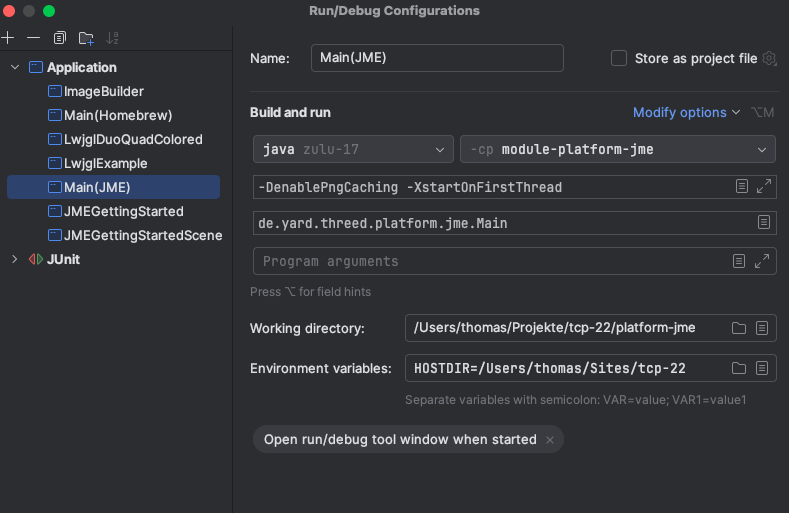

# tcp-22

A cross platform 3D graphics meta engine for Java, but still WiP!

See https://thomass171.github.io/tcp-22/tcp-22.html for examples 
and https://thomass171.github.io/maze-games/mazegames.html and
https://thomass171.github.io/tcp-flightgear/tcp-flightgear.html for use cases.

# Building And Deploying

This shows the build and installation to a web browser running locally serving from
directory $HOME/Sites. Set shell variable HOSTDIR, eg.:

```
export HOSTDIR=$HOME/Sites/tcp-22
```
and create that base directory. 

Run the following steps either manually or use the script bin/buildAndDeploy.sh for running all.

Deploy static content bundles needed for building to $HOSTDIR:

```
sh bin/deployBundle.sh data
sh bin/deployBundle.sh corrupted
sh bin/deployBundle.sh -m maze
sh bin/deployBundle.sh -S -m engine
sh bin/deployBundle.sh -m traffic
```
 
The module platform-jme requires customized JMonkeyEngine build artifact files, which were built
from JMonkeyEngine 3.2.4-stable with all datatypes float replaced by double. These use the legacy version
2.9.3 of lwjgl (http://legacy.lwjgl.org).

These files reside in subfolder lib and should be installed in the local maven repository.
```
for l in jme3-core jme3-desktop jme3-effects jme3-lwjgl
do
  mvn install:install-file -Dfile=./platform-jme/lib/jme3-core-3.2.4-dbl.jar -DgroupId=org.jmonkeyengine -DartifactId=jme3-core -Dversion=3.2.4-dbl -Dpackaging=jar
done  
```

Maven is needed for building. Run

```
mvn clean install
```

for building.
Deploy the software:

```
sh bin/deploy.sh
```

Deploy the remaining bundles:

```
sh bin/deployBundle.sh -m engine
```

## Unity
Convert the needed files to CS (be sure to use a zsh compatible shell like bash):
```
for m in core engine maze outofbrowser-common
do
        zsh bin/java2cs.sh $m
done
```
The converted files are copied to _platform-unity/PlatformUnity/Assets/scripts-generated_

Open the project platform-unity/PlatformUnity in Unity. It should compile all the
files with some errors related to using delegates. Unfortunately the converter does not 
remove the FunctionalInterface (which become delegates in CS) method names, so you need to remove these manually.
In detail these are:

* ImageHelper:handler.handlePixel
* AbstractSceneRunner:handler.handle
* An @Override annotation needs to be removed in GraphVisualizer.cs manually
* DefaultMenuProvider:menuBuilder.buildMenu
* EcsEntity:entityFilter.matches
* ReferenceScene:GeneralHandler.handle
* PointVisitor.visit
* PointValidator.isValid
* LinePrinter.println
* EntityFilter.matches
* ModelBuilder.buildModel

Furthermore manual fixes are needed
* in AbstractSceneRunner for futures list

The code pieces are prepared and marked with "C#".

Unity needs to know your HOSTDIR for finding bundle data.
Go to file Main.js and adjust the SetEnvironmentVariable() call accordingly.

And it might be necessary to reassign the script file
Main.cs to game object "MyScriptContainer" to trigger it.

Now the scene "SampleScene" is ready to be started.

# JMonkeyEngine

Nothing special to do any more. All is prepared to launch a scene in JMonkeyEngine.

# Running
## Browser
Enter the URL
```
http://localhost/<youruserdir>/tcp-22/tcp-22.html?host=http://localhost/<youruserdir>/tcp-22
```
in your browser. Be sure to add the "host" parameter for really accessing your local installation.
Check the developer console for possible errors. 
You should see the [ReferenceScene](engine/src/main/java/de/yard/threed/engine/apps/reference/ReferenceScene.java)


## Unity
Just start the scene.


## JMonkeyEngine

Start a scene by the wrapper script launchScene.sh, eg.:

```
sh bin/launchScene.sh de.yard.threed.engine.apps.reference.ReferenceScene
```


## HomeBrew

Start a scene by the wrapper script launchScene.sh, eg.:

```
sh bin/launchScene.sh -p homebrew de.yard.threed.engine.apps.reference.ReferenceScene
```

## Settings

The following properties are evaluated from the environment or system properties.

ADDITIONALBUNDLE

This is a colon separated list of bundle locations, either filesystem paths or web URLs. The default
  bundle location is $HOSTDIR/bundles for filesystems and 'origin'/bundles from a browser.

## Properties
(what is the difference to 'Settings'?)

initialVehicle:  Just a name as reference to a defined vehicle (in future maybe also or a full qualified path to a config).

initialRoute
### Generic

### Use Case Maze

### Use Case Traffic
| Property       | Purpose                                                                          |
|----------------|----------------------------------------------------------------------------------|
| enableAutomove | Start vehicle immediately after scene start without the need for a start request |
|    |                                                                                  |

# Development
The most convenient way is to develop for a Java platform like JME (or homebrew) initially and later test it on other platforms
like ThreeJs and Unity. Thats because the other platforms need converting which reduces
roundtrip time.

In your IDE you might create a launch configuration like the following.



For running Java 3D software native libraries like 'lwjgl' are required.
These are typically located in the current working directory or via LD_LIBRARY_PATH.

## Build your own scene
The best starting point is to use class [ReferenceScene](engine/src/main/java/de/yard/threed/engine/apps/reference/ReferenceScene.java) and modify it for your needs.

## GWT
Platform platform-webgl uses GWT to compile Java code to JS. GWT Dev mode is started as usual by
```
cd platform-webgl
mvn gwt:run
```
This starts a local Jetty and makes the main entry point "available at http://127.0.0.1:8888/webgl.html". 
However, the page shown is empty, because parameter are missing. Open the
dev console of the browser for additional information.

For ReferenceScene use
```
ADDITIONALBUNDLE=engine,data@http://localhost:80/~thomas/tcp-22/bundles
```
which leads to URL
```
http://localhost:8888/webgl.html?scene=ReferenceScene&devmode=true&ADDITIONALBUNDLE=ZW5naW5lLGRhdGFAaHR0cDovL2xvY2FsaG9zdDo4MC9+dGhvbWFzL3RjcC0yMi9idW5kbGVz
```

and for maze with the default sokoban grid it will be
```
http://localhost:8888/webgl.html?scene=MazeScene&devmode=true&ADDITIONALBUNDLE=ZW5naW5lLGRhdGEsbWF6ZUBodHRwOi8vbG9jYWxob3N0OjgwL350aG9tYXMvdGNwLTIyL2J1bmRsZXM=
```

For avoiding URL de/encoding issues, ADDITIONALBUNDLE parts which are URLs need to be base64 encoded.

Don't forget to allow access in your web server by setting corresponding CORS header.

# Measures

MA46: Defer processing of newly created events in a frame cycle. Otherwise a server system
might keep processing without giving the client the chance to catch up. 
Occured in the sequence LOGGEDIN->JOINED->ASSEMBLED.

# Credits

See https://thomass171.github.io/tcp-22/tcp-22.html for credits.

# Releases
This is the release list In terms of installations to the examples hosting
server used from https://thomass171.github.io/tcp-22/tcp-22.html. Every release contains lots of bug fixes.
Only major changes are listed here.

## 2021-06
Initial release
## 2022-04
Major changes:
  * Additional 'P' style maze games 
## 2022-12
Major changes:
  * VR moving in mazes by controller stick instead of using teleport location marker.
## 2023-03
  * fix for parameter "offsetVR" passing in browser
  * preparation for multi player scene server.

## 2023-05
  * multi player server completed

## 2023-07-18
  * fix for NPE when firing

## 2023-08-25
  * upgrade GWT 2.8.1 -> 2.10
  * Ready for Java 17 (still language level 8/9 for C# parts)
  * Sound added

## 2024-01-04
  * Bundle load refactoring including remote bundle
  * More traffic configuration including aircraft
  * InitChain for init

##
  * upgrade of maven-compiler-plugin to 3.12 for setting java release 11 
 
# Technical Details

## Architecture

<!-- two similar options -->


## Design

### Spheres
A sphere is a limited area of gaming like
- an airport in flight simulation
- the solar system in a space simulation
- a grid in a maze game
- a lobby for entering a game

The transition from one sphere to the other might be animated, or just showing a 
screen 'Loading...' or whatever. Spheres are controlled by the SphereSystem.

## ECS
An Entity Component System (ECS) is a software architectural pattern that helps organizing software.

Events and Requests are the main elements for inter system communication. But where to register these?

For example in client/server mode a "UserSystem" runs on the server not the client. But the client needs to
send LOGIN requests and might process LoggedIn events. This suggests to decouple event/request registration from specific systems.

### Traffic request/event flow


Startup of a TravelScene(Bluebird) in tcp-flightgear (parts currently hard coded):


Load a vehicle (eg. by pressing key 'l' or setting property 'initialVehicle'):


### Data Flow
Data available in one system might also be needed in other systems. The options are

- other systems read data again
- data is transferred via events
- data is available by a DataProvider

Anyway, data units should be fine granular and specific for avoiding
coupling and dependencies.
The event option with small packets is currently the preferred option.

## Authentication

Authentication is useful when data is shared across several user.

The hoster of a maze or sceneserver is the adminstrator and defines the 'admin'
password by properties

* servermanager.admin.password
* services.admin.password

## Modules

### Scene Server
A simple Java network server, no GWT, no C#. Uses a headless platform. Might also be a Web server (Jetty,
Tomcat, SpringBoot), but for now its just using plain (web)socket communication. This might be replaced later by a more
sophisticated network layer (MQTT?).

Because there is no need for GWT and C#, there is no limitation in using Java. So logging 
outside the platform (SL4J) and reflection might be used..

### services
A SpringBoot applications that provides maze grid CRUD services via HTTP.

### servermanager
A SpringBoot application that provides scene server control via HTTP, eg.:

* launch a scene server for a specific scene

Start the server manager (and enable DEBUG logging) with
```
cd servermanager
mvn spring-boot:run -Dspring-boot.run.arguments="--logging.level.de.yard.threed=DEBUG"
```

The UI is then available on 'http://localhost:8080/servermanager.html'.

## Bundles

Bundles are a well defined set of resources (files) that reside somewhere.
They are identified by a name. Lookup is done by bundle resolver which
check whether they know how to load a bundle. The first resolver wins.

Alternatively, a bundle can be loaded with a full qualified name ('bundle@location'), which
doesn't need a resolver.

Additionally a bundle can be loaded by a HTTP URL. The path must point to
a directory where a file directory.txt must exist, eg.:

```
https://yard.de/bundlepool/fgdatabasicmodel
```
The bundle name will be derived from the last segment of the URL.

## Async Operations
These occur when blocking operations (network IO) use a callback. Multithreading
related asyncs are not considered as MT isn't used at all. Game engines
do not like MT.

Some of the async operations are capsuled inside the platform, eg. loading
a texture. These are not of further interest to the app.

Other async operations that are of interest to the app (like bundle loading) are capsuled
in AbstractSceneRunner, that cares for a consistent program flow 
by executing all pending callbacks while preparing a frame.

## Java Language Level
Changed from Java 8 to Java 11 in January 24 due to ClassCastExceptions in java.nio.(Byte)Buffer flip() and clear().
There was a kind of breaking change in the API after Java 8. Still needs care about Java 9
limitation for C# conversion.